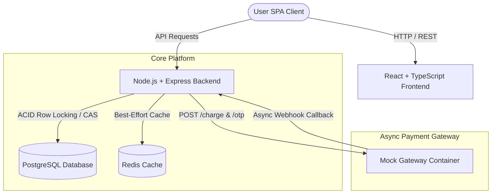

# CinemaSeat (CinemaBook)

> **Build a movie booking system that stays calm when *Spider-Man: Brand New Day* drops, and never sells the same seat twice.**

CinemaSeat is a high-concurrency, zero-oversell movie ticket booking platform built for blockbuster ticket drops. It guarantees **ACID seat lock consistency**, **asynchronous payment resilience**, and **idempotent webhook processing**.

---

## 1. System Architecture



### Micro-Architecture & Data Flow
1. **Seat Map Query (`GET /api/showtimes/:id/seats`)**: Hits a short-lived Redis cache (`SEAT_MAP_CACHE_TTL_SECONDS`). Fallback to Postgres if Redis is unreachable.
2. **Atomic Seat Hold (`POST /api/showtimes/:id/seats/:seatId/hold`)**:
   - **Redis Fast Concurrency Gate**: Attempts an atomic lock `SET seat:lock:{showtimeId}:{seatId} {bookingRef} NX EX {HOLD_TTL_SECONDS}`. Rejects concurrent losers immediately with HTTP 409 (`LOCK_REJECTED`), shedding database load.
   - **PostgreSQL Final Source of Truth**: Winner executes single atomic SQL `UPDATE seats SET status = 'HELD'... WHERE (status = 'AVAILABLE' OR (status = 'HELD' AND hold_expires_at < now()))`. If DB hold creation fails, Redis lock is immediately released. If Redis is unavailable, system gracefully falls back to Postgres atomic locking.
3. **Async Payments (`POST /api/bookings/:ref/pay`)**: Returns HTTP `202 PENDING` instantly. Payment completion is handled asynchronously by gateway webhooks.
4. **Idempotent Webhooks (`POST /api/payments/callback`)**: Webhook events hit a `payment_events` table with `event_id` as PRIMARY KEY. Duplicate callbacks hit `ON CONFLICT DO NOTHING` and return HTTP `200` without double-booking or double-counting revenue.

---

## 2. Running Locally (From Clone to Docker Compose Up)

Ensure Docker Desktop or Docker Engine is running on your machine.

```bash
# 1. Clone the repository
git clone https://github.com/your-team/cinemaseat.git
cd cinemaseat

# 2. Spin up the entire stack with Docker Compose
docker compose up --build
```

The stack automatically handles:
- **Postgres Database**: Initializes schema (`001_init.sql`) and seeds default movies, showtimes, and seat maps (`seed.ts`).
- **Redis**: Connects for caching seat maps.
- **Mock Gateway**: Starts image `asifmahmoud414/mock-gateway:latest` on port `9000`.
- **Backend API**: Starts Node/Express server on `http://localhost:4000`.
- **Frontend SPA**: Starts Vite app on `http://localhost:5173`.

### Running Services Manually (Development Mode)

If you wish to run the backend and frontend services locally on your host machine during development:

1. **Start Database and Redis**:
   ```bash
   # Spin up database and redis dependencies
   docker compose up postgres redis -d
   ```
   *(Note: Ensure Docker is running to launch Postgres and Redis)*

2. **Run Mock Gateway Service (Required for OTP & Payments)**:
   ```bash
   cd gateway
   npm install
   # Start the mock gateway on port 9000
   npm run dev
   ```

3. **Run Backend API Server**:
   ```bash
   cd backend
   npm install
   # Apply database migrations
   npx tsx src/db/migrate.ts
   # Start the Express server in development mode
   npm run dev
   ```
   The backend will be running on `http://localhost:4000`.

4. **Run Frontend App**:
   ```bash
   cd frontend
   npm install
   # Start the Vite development server
   npm run dev
   ```
   The frontend will be running on `http://localhost:5173`.

---

## 3. Exact API Request Documentation (Judging Hooks)

### A. Fetching a Seat Map
Retrieve the live seat layout and availability state for a showtime.

```bash
curl -X GET http://localhost:4000/api/showtimes/30000000-0000-0000-0000-000000000001/seats \
  -H "Accept: application/json"
```

**Response (200 OK):**
```json
[
  {
    "id": "a0000000-0000-0000-0000-000000000101",
    "showtime_id": "30000000-0000-0000-0000-000000000001",
    "seat_row": "A",
    "seat_col": 1,
    "seat_label": "A1",
    "seat_type": "STANDARD",
    "price": "350.00",
    "status": "AVAILABLE",
    "hold_expires_at": null,
    "held_by_booking_ref": null
  }
]
```

### B. Holding a Seat
Attempt to place an atomic hold on a specific seat for a showtime.

```bash
curl -X POST http://localhost:4000/api/showtimes/30000000-0000-0000-0000-000000000001/seats/a0000000-0000-0000-0000-000000000101/hold \
  -H "Content-Type: application/json" \
  -d '{
    "phone": "+8801700000000"
  }'
```

**Response (201 Created / 200 OK):**
```json
{
  "booking_ref": "bk_8d93f1a2",
  "seat": {
    "id": "a0000000-0000-0000-0000-000000000101",
    "seat_label": "A1",
    "price": "350.00"
  },
  "hold_ttl_seconds": 120,
  "hold_expires_at": "2026-08-08T12:02:00.000Z"
}
```

---

## 4. Deployed Live URL

- **Production URL**: `http://your-poridhi-vm-ip:5173` (or AWS EC2 Endpoint)
- **Backend API**: `http://your-poridhi-vm-ip:4000`

---

## 5. Automated Verification & Test Scripts

To verify zero overselling and payment failure matrices locally:

```bash
# 1. Run 100-request single seat concurrency test (Zero overselling)
npx tsx scripts/test_concurrency.ts

# 2. Run payment failure, timeout, and duplicate callback idempotency test matrix
npx tsx scripts/test_payment_matrix.ts

# 3. Run abandoned hold expiration test
npx tsx scripts/test_abandoned_hold.ts
```

---

## 6. Project Documentation Links
- [`DECISIONS.md`](./DECISIONS.md): Mandatory technical decision log (3 core debates and trade-offs).
- [`docs/RELIABILITY_ANALYSIS.md`](./docs/RELIABILITY_ANALYSIS.md): Comprehensive system analysis and database locking mechanics.
- [`docs/TESTING.md`](./docs/TESTING.md): Detailed testing guide and benchmark instructions.